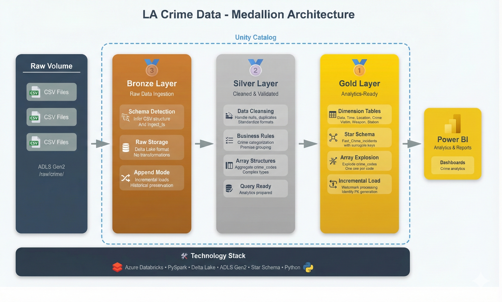
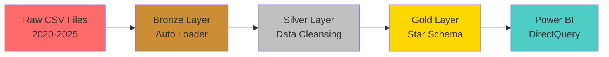
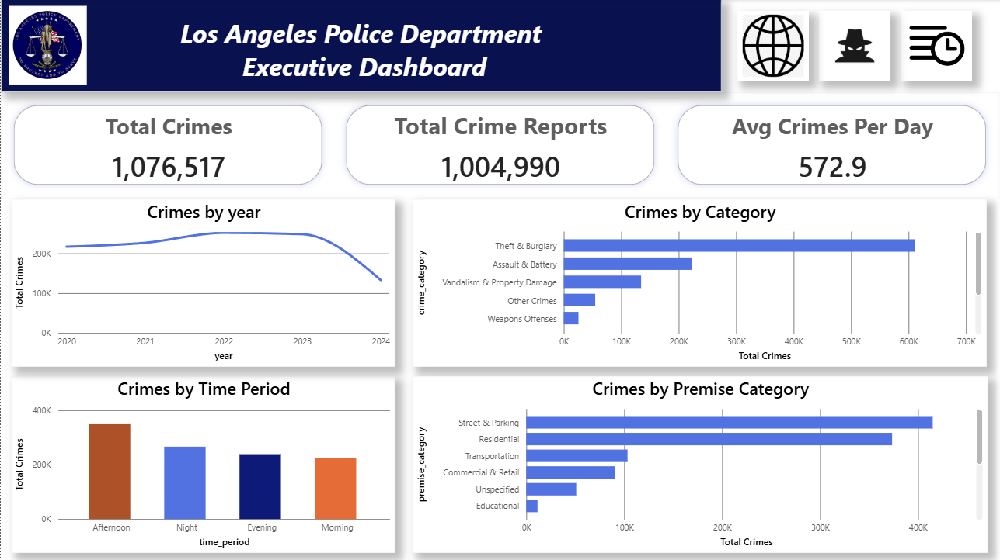
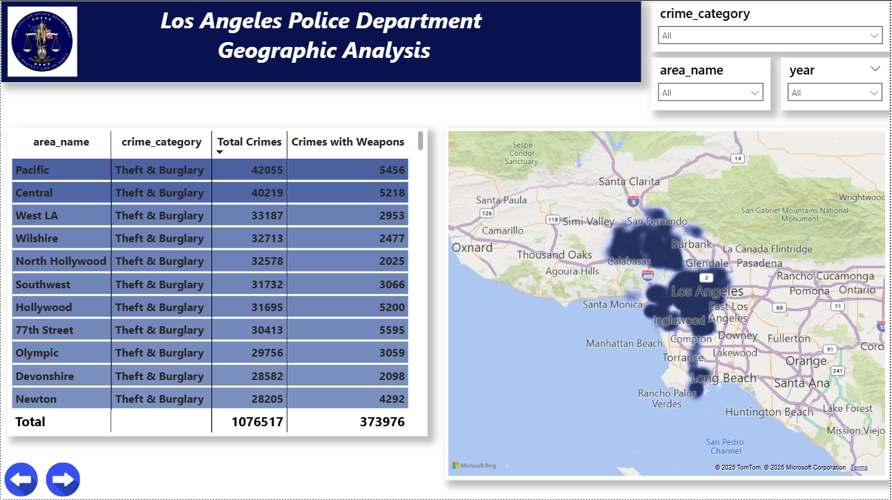
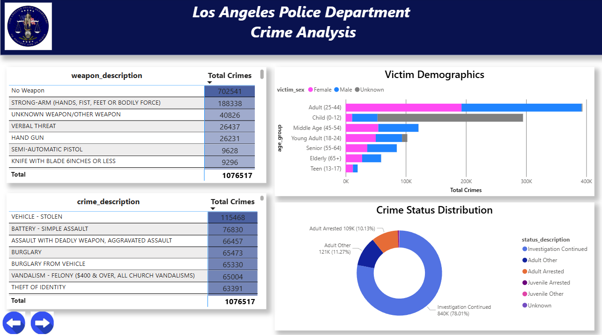
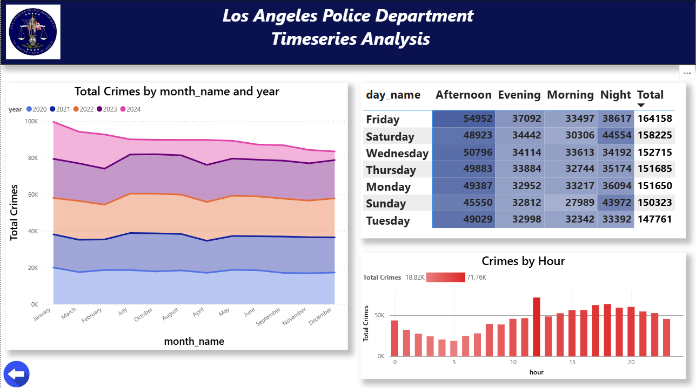
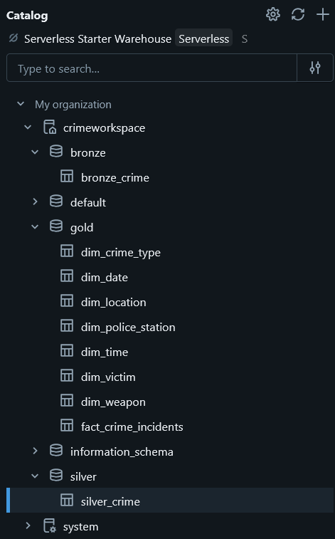
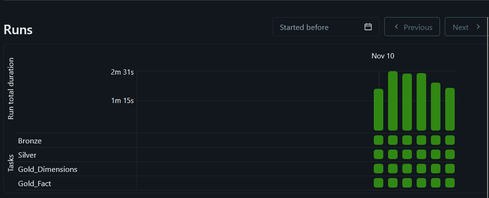

# 🚔 Los Angeles Crime Data Engineering Project

<div align="center">


**End-to-end data engineering solution for Los Angeles crime analysis (2020-2025)**

[📊 View Dashboard](#dashboard-preview) • [🗂️ Architecture](#architecture) • [🚀 Quick Start](#setup-instructions) • [📖 Documentation](#documentation)

</div>

---

## 📋 Table of Contents

- [Project Overview](#project-overview)
- [Key Features](#key-features)
- [Architecture](#architecture)
- [Dashboard Preview](#dashboard-preview)
- [Technology Stack](#technology-stack)
- [Project Structure](#project-structure)
- [Pipeline Components](#pipeline-components)
- [Data Transformations](#data-transformations)
- [Setup Instructions](#setup-instructions)
- [Usage Guide](#usage-guide)
- [Data Schema](#data-schema)
- [Best Practices Implemented](#best-practices-implemented)
- [Future Enhancements](#future-enhancements)
- [Authors](#authors)

---

## Project Overview

A comprehensive **data engineering solution** that transforms raw Los Angeles crime data into actionable insights through a modern data stack. This project implements industry best practices including **medallion architecture**, **incremental data processing**, and **dimensional modeling** to process over **1 million crime records** efficiently.

### Business Impact

- 📊 **Data-Driven Policing**: Enable law enforcement to identify crime patterns and allocate resources effectively
- 🗺️ **Geographic Intelligence**: Pinpoint high-crime areas for targeted intervention
- ⏰ **Temporal Analysis**: Understand when crimes occur to optimize patrol schedules
- 👥 **Victim Demographics**: Identify vulnerable populations for preventive programs

### Technical Achievements

- ⚡ **Performance Improvement** through incremental dimension updates
- 🔄 **Zero Data Duplication** via Auto Loader checkpoint mechanism
- 📈 **Scalable Architecture** capable of handling years of crime data
- 🎨 **Real-time Analytics** with Power BI DirectQuery integration

---

## Key Features

<table>
<tr>
<td width="50%">

### 🛡️ **Robust Architecture**

- **Medallion Design Pattern** (Bronze → Silver → Gold)
- **Unity Catalog Integration** for data governance
- **Delta Lake Storage** with ACID transactions
- **Incremental Processing** at every layer

</td>
<td width="50%">

### ⚡ **Performance Optimized**

- **Auto Loader** with checkpoint tracking
- **Watermark-based Processing** to avoid recomputation
- **Optimized Star Schema** for fast queries
- **DirectQuery** for real-time dashboard updates

</td>
</tr>
<tr>
<td width="50%">

### 📊 **Advanced Analytics**

- **7 Dimension Tables** for rich analysis
- **1M+ Fact Records** with full lineage
- **8 Crime Categories** intelligently mapped
- **12 Premise Types** for location analysis

</td>
<td width="50%">

### 🎨 **Interactive Visualization**

- **4 Specialized Dashboard Pages**
- **20+ Interactive Visuals**
- **Cross-filtering** and drill-through
- **Custom DAX Measures** for insights

</td>
</tr>
</table>

---

## Architecture

<div align="center">

### Medallion Architecture Flow



</div>



### Layer Responsibilities

| Layer         | Purpose            | Key Features                               | Output                            |
| ------------- | ------------------ | ------------------------------------------ | --------------------------------- |
| 🟤 **Bronze** | Raw data ingestion | Auto Loader, Checkpoint, Metadata tracking | Delta table with all source data  |
| ⚪ **Silver** | Data cleansing     | Watermarking, Type casting, Categorization | Clean, typed, enriched data       |
| 🟡 **Gold**   | Business logic     | Star schema, Surrogate keys, Aggregations  | Analytics-ready dimensional model |
| 🔵 **BI**     | Visualization      | DirectQuery, Interactive dashboards        | Business insights                 |

### 💻 Technology Stack

<div align="center">


</div>

**Platform:** Databricks (Azure/AWS) • **Storage:** Unity Catalog with Delta Lake • **Languages:** Python, PySpark, SQL, DAX • **Orchestration:** Databricks Workflows • **Visualization:** Microsoft Power BI

---

## Dashboard Preview

<div align="center">

### Executive Dashboard - KPIs & Trends



_Real-time crime statistics with year-over-year trends and category breakdowns_

---

### Geographic Analysis - Crime Hotspots



_Interactive map showing crime distribution across Los Angeles police areas_

---

### Crime Analysis - Deep Dive



_Weapon usage patterns, victim demographics, and case status tracking_

---

### Timeseries Analysis - Temporal Patterns



_Hourly, daily, and monthly crime trends with heatmap visualization_

</div>

---

## Project Structure

```
los-angeles-crime-data-engineering/
│
├── 📓 notebooks/                    # Databricks processing notebooks
│   ├── Bronze_with_autoLoader.ipynb      # Layer 1: Raw data ingestion
│   ├── Silver_Notebook.ipynb             # Layer 2: Data cleansing
│   ├── Gold_Dimensions_Notebook.ipynb    # Layer 3a: Dimension tables
│   └── Gold_Fact_Notebook.ipynb          # Layer 3b: Fact table
│
├── 📊 powerbi/                      # Business Intelligence
│   └── Los_Angeles_Crime_Dashboard.pbix      # Interactive dashboard (4 pages)
│
├── 📖 docs/                         # Documentation
│   ├── Architecture.png                  # System architecture diagram
│   ├── databricks_screenshots/           # Databricks execution logs
│   │   ├── Unity_Catalog_Overview.png
│   │   └── DBX_job_run.png
│   └── dashboard_screenshots/            # Power BI dashboard images
│       ├── executive_dashboard.png
│       ├── geographic_analysis.png
│       ├── crime_analysis.png
│       └── timeseries_analysis.png
│
└── 📄 README.md                     # This file
```

---

## Pipeline Components

<div align="center">

### Unity Catalog Structure



</div>

### 1️⃣ Bronze Layer: Raw Data Ingestion

**Purpose:** Ingest raw CSV files with zero data loss and full auditability

```python
# Key Technologies: Auto Loader, Checkpoint, Delta Lake
Features:
✅ Incremental file detection via Auto Loader
✅ Checkpoint tracking prevents duplicate processing
✅ Schema inference and evolution handling
✅ Metadata enrichment (ingest_ts, source_file)
✅ Schema-on-read (all columns as strings initially)
```

**Input:** CSV files (crime_2020.csv through crime_2025.csv)  
**Output:** `crimeworkspace.bronze.bronze_crime` Delta table  
**Processing Time:** ~2 minutes per 200K records

---

### 2️⃣ Silver Layer: Data Cleansing & Transformation

**Purpose:** Transform raw data into clean, typed, and enriched records

```python
# Key Technologies: Watermarking, PySpark Transformations
Features:
✅ Watermark-based incremental processing (max(ingest_ts))
✅ Data type conversions (strings → dates, integers, doubles)
✅ 8 Crime Categories intelligent mapping
✅ 12 Premise Categories classification
✅ Null handling and data quality rules
✅ Array creation for multiple crime codes
✅ Deduplication by crime_report_id
```

**Transformations Applied:**

- 📅 Date parsing: `11/07/2020 12:00:00 AM` → `2020-11-07`
- ⏰ Time conversion: `845` → `08:45`
- 🏷️ Category mapping: Regex-based crime categorization
- 👤 Victim standardization: `M` → `Male`, `F` → `Female`
- 🏢 Premise grouping: 300+ premises → 12 categories

**Input:** `bronze.bronze_crime` (new records only)  
**Output:** `crimeworkspace.silver.silver_crime` Delta table  
**Processing Time:** ~3 minutes per 200K records

---

### 3️⃣ Gold Layer: Dimensional Modeling

**Purpose:** Create analytics-optimized star schema for business intelligence

#### 📊 Dimension Tables (7 Total)

<details>
<summary><b>🗓️ Dim_Date</b> - Comprehensive date dimension (2020-2030)</summary>

**Columns:** date_key, year, quarter, month, day, week_of_year, day_of_week, day_name, month_name, is_weekend, fiscal_year, quarter_name

**Special Features:**

- Pre-built for 11 years (4,018 dates)
- Fiscal year calculations
- Weekend/weekday flags
- Supports time intelligence in Power BI

**Created Once:** Never updated (static dimension)

</details>

<details>
<summary><b>⏰ Dim_Time</b> - Minute-level time dimension (00:00 to 23:59)</summary>

**Columns:** time_key (HH:mm), hour, minute, time_period, hour_12_format

**Time Periods:**

- Morning: 6:00-11:59
- Afternoon: 12:00-17:59
- Evening: 18:00-21:59
- Night: 22:00-05:59

**Created Once:** Never updated (static dimension)

</details>

<details>
<summary><b>🚓 Dim_Police_Station</b> - Police area and district mapping</summary>

**Columns:** station_key (PK), area_code, area_name, reporting_district

**Unique Key:** (area_code + reporting_district)

**Update Strategy:** Incremental merge (leftanti join)

</details>

<details>
<summary><b>📍 Dim_Location</b> - Crime scene location details</summary>

**Columns:** location_key (PK), premise_code, premise_description, premise_category, latitude, longitude

**12 Premise Categories:**

1. Residential
2. Street & Parking
3. Commercial & Retail
4. Educational
5. Recreation & Parks
6. Transportation
7. Healthcare
8. Religious
9. Government & Office
10. Industrial
11. Cyberspace
12. Other/Unspecified

**Update Strategy:** Incremental merge (leftanti join)

</details>

<details>
<summary><b>🚨 Dim_Crime_Type</b> - Crime classification hierarchy</summary>

**Columns:** crime_type_key (PK), crime_code, crime_description, crime_category, crime_part

**8 Crime Categories:**

1. Theft & Burglary
2. Assault & Battery
3. Vehicle Crimes
4. Vandalism & Property Damage
5. Sex Crimes & Child Abuse
6. Homicide
7. Weapons Offenses
8. Other Crimes

**Update Strategy:** Incremental merge (leftanti join)

</details>

<details>
<summary><b>👥 Dim_Victim</b> - Victim demographic profiles</summary>

**Columns:** victim_key (PK), victim_age, age_group, victim_sex, victim_descent

**Age Groups:** Child (0-12), Teen (13-17), Young Adult (18-24), Adult (25-44), Middle Age (45-54), Senior (55-64), Elderly (65+)

**Update Strategy:** Incremental merge (leftanti join)

</details>

<details>
<summary><b>🔫 Dim_Weapon</b> - Weapon type classification</summary>

**Columns:** weapon_key (PK), weapon_code, weapon_description

**Top Weapons:** No Weapon (45%), Handgun (18%), Strong-Arm (12%), Knife (8%), Unknown (7%)

**Update Strategy:** Incremental merge (leftanti join)

</details>

#### 📊 Fact Table

**Fact_Crime_Incidents** - Grain: One row per crime incident per exploded crime code

**Columns:**

- `fact_key` (PK) - Auto-incrementing identity
- `crime_report_id` - Business key
- 7 Foreign Keys → Dimension tables
- `exploded_crime_code` - Additional crime codes (from array)
- `status_description` - Investigation status (degenerate dimension)
- Metadata: `ingest_ts`, `source_file`, `fact_created_ts`

**Update Strategy:** Watermark + incremental identity generation  
**Processing Time:** ~4 minutes per 200K records

---

## Data Transformations

### Why Incremental Processing Matters

❌ **Without Incremental:**

- Expensive compute costs
- Duplicate risk
- Scalability issues

✅ **With Incremental:**

- Process only new records
- Cost savings
- Zero duplicates guaranteed
- Handles millions of records easily

### Implementation Details

<table>
<tr>
<td width="33%">

**🟤 Bronze Layer**

```python
# Auto Loader magic
spark.readStream
  .format("cloudFiles")
  .option("checkpointLocation", path)
  .load(raw_path)
```

**Mechanism:** Checkpoint file tracking  
**Benefit:** Each CSV processed exactly once

</td>
<td width="33%">

**⚪ Silver Layer**

```python
# Watermark filtering
max_ts = silver.agg(max("ingest_ts"))
bronze.filter(col("ingest_ts") > max_ts)
```

**Mechanism:** Timestamp comparison  
**Benefit:** Only new bronze records processed

</td>
<td width="33%">

**🟡 Gold Layer**

```python
# Leftanti join for dimensions
new_data.join(
    existing_dim,
    keys,
    "leftanti"
)
```

**Mechanism:** Find non-matching records  
**Benefit:** Faster dimension updates

</td>
</tr>
</table>

---

## Setup Instructions

### Prerequisites

<table>
<tr>
<td width="50%">

**☁️ Cloud & Platform**

- Databricks workspace (Azure/AWS/GCP)
- Unity Catalog enabled
- Cluster: Standard_DS3_v2 or equivalent
- Runtime: 14.3 LTS or later

</td>
<td width="50%">

**💻 Local Environment**

- Power BI Desktop (latest version)
- Git for version control
- Optional: Python 3.8+ for local testing

</td>
</tr>
</table>

### Step-by-Step Setup

#### 1️⃣ Create Unity Catalog Structure

```sql
-- Execute in Databricks SQL Editor

-- Create catalog
CREATE CATALOG IF NOT EXISTS crimeworkspace;

-- Create schemas (medallion layers)
CREATE SCHEMA IF NOT EXISTS crimeworkspace.bronze;
CREATE SCHEMA IF NOT EXISTS crimeworkspace.silver;
CREATE SCHEMA IF NOT EXISTS crimeworkspace.gold;

-- Create volumes for raw data and checkpoints
CREATE VOLUME IF NOT EXISTS crimeworkspace.default.raw;
CREATE VOLUME IF NOT EXISTS crimeworkspace.default.checkpoints;

-- Verify setup
SHOW CATALOGS;
SHOW SCHEMAS IN crimeworkspace;
SHOW VOLUMES IN crimeworkspace.default;
```

#### 2️⃣ Upload Data Files

**Important:** Upload files **one at a time** and run the pipeline after each upload for proper incremental processing.

```bash
# Upload sequence (wait for pipeline completion between each)
1. Upload crime_2020.csv → Run pipeline → Wait
2. Upload crime_2021.csv → Run pipeline → Wait
3. Upload crime_2022.csv → Run pipeline → Wait
4. Upload crime_2023.csv → Run pipeline → Wait
5. Upload crime_2024.csv → Run pipeline → Wait
6. Upload crime_2025.csv → Run pipeline → Done! ✅
```

**Upload Location:**

```
/Volumes/crimeworkspace/default/raw/
├── crime_2020.csv  ← Start here
├── crime_2021.csv
├── crime_2022.csv
├── crime_2023.csv
├── crime_2024.csv
└── crime_2025.csv  ← End here
```

#### 3️⃣ Import Notebooks

1. Download notebooks from `notebooks/` folder
2. In Databricks: **Workspace** → **Import**
3. Upload all 4 notebooks
4. Organize in a folder: `los-angeles-crime-pipeline/`

#### 4️⃣ Create Databricks Job

<div align="center">



</div>

**Job Name:** `Los_Angeles_Crime_ETL_Pipeline`

**Task Configuration:**

```
Task 1: Bronze_with_autoLoader
   ↓ (depends on success)
Task 2: Silver_Notebook
   ↓ (depends on success)
Task 3: Gold_Dimensions_Notebook
   ↓ (depends on success)
Task 4: Gold_Fact_Notebook
```

**Cluster Settings:**

- Type: Job Cluster (auto-terminate)
- Workers: 1-3 (autoscaling)
- Node Type: Standard_DS3_v2
- Runtime: 14.3 LTS

**Trigger:** Manual (run after each file upload), can be scheduled for another use case (like daily)

#### 5️⃣ Execute Pipeline

For each CSV file uploaded:

1. ✅ Upload CSV to raw volume
2. ✅ Trigger Databricks job
3. ✅ Monitor execution (should complete in ~10 mins)
4. ✅ Verify data in each layer:
   ```sql
   SELECT COUNT(*) FROM crimeworkspace.bronze.bronze_crime;
   SELECT COUNT(*) FROM crimeworkspace.silver.silver_crime;
   SELECT COUNT(*) FROM crimeworkspace.gold.fact_crime_incidents;
   ```
5. ✅ Check for errors in job logs
6. ✅ Proceed to next file

#### 6️⃣ Connect Power BI

**Get Connection Details:**

1. In Databricks: **SQL Warehouses** → Select your warehouse
2. Click **Connection Details** tab
3. Note: **Server hostname** and **HTTP path**

**Generate Access Token:**

1. Databricks: **Settings** → **Developer** → **Access Tokens**
2. Generate new token (90-day expiry)
3. Copy and save securely

**In Power BI Desktop:**

1. **Get Data** → **Azure Databricks**
2. Enter server hostname and HTTP path
3. **Data Connectivity:** DirectQuery (recommended)
4. **Authentication:** Username = `token`, Password = [your token]
5. Select all 8 tables (1 fact + 7 dimensions)
6. Load data

**Open Dashboard:**

- Open `powerbi/Los_Angeles_Crime_Dashboard.pbix`
- Refresh credentials if needed
- Explore the 4 interactive pages!

---

## 📖 Usage Guide

### Running the Pipeline

**For First-Time Setup:**

```bash
1. Upload crime_2020.csv
2. Run job → Complete ✅
3. Verify: ~200K records in each layer
```

**For Incremental Loads:**

```bash
1. Upload crime_2021.csv (or next file)
2. Run same job → Only new data processed ✅
3. Verify: Record count increased by ~220K
```

### Monitoring & Validation

**Check Pipeline Health:**

```sql
-- Verify record counts match across layers
SELECT
    'Bronze' as layer,
    COUNT(*) as records,
    COUNT(DISTINCT source_file) as files
FROM crimeworkspace.bronze.bronze_crime
UNION ALL
SELECT 'Silver', COUNT(*), COUNT(DISTINCT source_file)
FROM crimeworkspace.silver.silver_crime
UNION ALL
SELECT 'Gold Fact', COUNT(*), COUNT(DISTINCT source_file)
FROM crimeworkspace.gold.fact_crime_incidents;
```

**Check for Duplicates:**

```sql
-- Should return 0 rows
SELECT crime_report_id, COUNT(*) as duplicates
FROM crimeworkspace.silver.silver_crime
GROUP BY crime_report_id
HAVING COUNT(*) > 1;
```

**View Processing History:**

```sql
-- See which files have been processed
SELECT
    source_file,
    MIN(ingest_ts) as first_processed,
    MAX(ingest_ts) as last_processed,
    COUNT(*) as record_count
FROM crimeworkspace.bronze.bronze_crime
GROUP BY source_file
ORDER BY first_processed;
```

---

## Data Schema

### Bronze Layer Schema (Raw)

<details>
<summary><b>28 Columns - Click to expand</b></summary>

| Column         | Type   | Description                | Example                  |
| -------------- | ------ | -------------------------- | ------------------------ |
| DR_NO          | String | Division of Records Number | "2012345678"             |
| Date_Rptd      | String | Date crime reported        | "11/07/2020 12:00:00 AM" |
| DATE_OCC       | String | Date crime occurred        | "11/06/2020 12:00:00 AM" |
| TIME_OCC       | String | Time occurred (military)   | "845"                    |
| AREA           | String | Police area code           | "01"                     |
| AREA_NAME      | String | Police area name           | "Central"                |
| Rpt_Dist_No    | String | Reporting district         | "0122"                   |
| Part_1_2       | String | Crime classification       | "1"                      |
| Crm_Cd         | String | Crime code                 | "310"                    |
| Crm_Cd_Desc    | String | Crime description          | "BURGLARY"               |
| Mocodes        | String | Modus operandi codes       | "1400 1822"              |
| Vict_Age       | String | Victim age                 | "35"                     |
| Vict_Sex       | String | Victim sex                 | "M"                      |
| Vict_Descent   | String | Victim descent code        | "W"                      |
| Premis_Cd      | String | Premise code               | "101"                    |
| Premis_Desc    | String | Premise description        | "STREET"                 |
| Weapon_Used_Cd | String | Weapon code                | "400"                    |
| Weapon_Desc    | String | Weapon description         | "STRONG-ARM"             |
| Status         | String | Status code                | "AA"                     |
| Status_Desc    | String | Status description         | "Adult Arrest"           |
| Crm_Cd_1       | String | Crime code 1               | "310"                    |
| Crm_Cd_2       | String | Crime code 2               | "320"                    |
| Crm_Cd_3       | String | Crime code 3               | null                     |
| Crm_Cd_4       | String | Crime code 4               | null                     |
| LOCATION       | String | Address                    | "100 W 1ST ST"           |
| Cross_Street   | String | Cross street               | null                     |
| LAT            | String | Latitude                   | "34.0522"                |
| LON            | String | Longitude                  | "-118.2437"              |

**Added Metadata:**

- `ingest_ts` - Timestamp of ingestion
- `source_file` - Source CSV filename

</details>

### Silver Layer Schema (Cleaned)

<details>
<summary><b>23 Columns - Click to expand</b></summary>

**Key Changes from Bronze:**

- ✅ Type conversions applied
- ✅ Categories mapped
- ✅ Nulls handled
- ✅ Array created for crime codes
- ✅ Dropped: Mocodes, LOCATION, CrossStreet

| Column               | Type      | Description          | Example                |
| -------------------- | --------- | -------------------- | ---------------------- |
| crime_report_id      | Long      | Primary key          | 2012345678             |
| date_reported        | Date      | Cleaned date         | 2020-11-07             |
| date_occurred        | Date      | Cleaned date         | 2020-11-06             |
| time_occurred        | String    | Formatted time       | "08:45"                |
| area_code            | Integer   | Police area          | 1                      |
| area_name            | String    | Police area name     | "Central"              |
| reporting_district   | Integer   | District number      | 122                    |
| crime_code           | Integer   | Crime code           | 310                    |
| crime_description    | String    | Description          | "BURGLARY"             |
| **crime_category**   | String    | **Mapped category**  | "Theft & Burglary"     |
| crime_part           | String    | Classification       | "1"                    |
| **crime_codes**      | Array     | **Additional codes** | [310, 320, null, null] |
| victim_age           | Integer   | Age                  | 35                     |
| victim_sex           | String    | Standardized sex     | "Male"                 |
| victim_descent       | String    | Full description     | "White"                |
| premise_code         | Integer   | Premise code         | 101                    |
| premise_description  | String    | Description          | "STREET"               |
| **premise_category** | String    | **Mapped category**  | "Street & Parking"     |
| latitude             | Double    | Coordinate           | 34.0522                |
| longitude            | Double    | Coordinate           | -118.2437              |
| weapon_code          | Integer   | Weapon code          | 400                    |
| weapon_description   | String    | Weapon type          | "STRONG-ARM"           |
| status_description   | String    | Case status          | "Adult Arrested"       |
| ingest_ts            | Timestamp | Ingestion time       | 2024-11-10 08:00:00    |
| source_file          | String    | Source file          | "crime_2020.csv"       |
| silver_processed_ts  | Timestamp | Processing time      | 2024-11-10 08:05:00    |

</details>

### Gold Layer Schema (Star Schema)

<details>
<summary><b>Fact Table + 7 Dimensions - Click to expand</b></summary>

**Fact_Crime_Incidents (15 columns)**

| Column              | Type      | Description                | Example             |
| ------------------- | --------- | -------------------------- | ------------------- |
| **fact_key**        | Long      | **Primary Key (Identity)** | 1                   |
| crime_report_id     | Long      | Business key               | 2012345678          |
| date_occurred_key   | Date      | FK to Dim_Date             | 2020-11-06          |
| date_reported_key   | Date      | FK to Dim_Date             | 2020-11-07          |
| time_key            | String    | FK to Dim_Time             | "08:45"             |
| station_key         | Integer   | FK to Dim_Police_Station   | 12                  |
| location_key        | Integer   | FK to Dim_Location         | 567                 |
| crime_type_key      | Integer   | FK to Dim_Crime_Type       | 45                  |
| victim_key          | Integer   | FK to Dim_Victim           | 234                 |
| weapon_key          | Integer   | FK to Dim_Weapon           | 15                  |
| exploded_crime_code | String    | Additional crime code      | "320"               |
| status_description  | String    | Degenerate dimension       | "Adult Arrested"    |
| ingest_ts           | Timestamp | Bronze timestamp           | 2024-11-10 08:00:00 |
| source_file         | String    | Source filename            | "crime_2020.csv"    |
| fact_created_ts     | Timestamp | Gold timestamp             | 2024-11-10 08:10:00 |

**Dimension Tables Structure:**

- Dim_Date: 12 columns (date attributes)
- Dim_Time: 5 columns (time attributes)
- Dim_Police_Station: 4 columns (area info)
- Dim_Location: 6 columns (premise + coordinates)
- Dim_Crime_Type: 5 columns (crime classification)
- Dim_Victim: 5 columns (demographics)
- Dim_Weapon: 3 columns (weapon info)

</details>

---

## Best Practices Implemented

### Data Engineering Excellence

<table>
<tr>
<td width="50%">

**🗂️ Architecture & Design**

- ✅ Medallion architecture (industry standard)
- ✅ Star schema for analytics optimization
- ✅ Separation of concerns (Bronze/Silver/Gold)
- ✅ Idempotent pipeline (safe to re-run)
- ✅ Schema evolution support
- ✅ Lineage tracking via metadata

</td>
<td width="50%">

**⚡ Performance & Scalability**

- ✅ Incremental processing at every layer
- ✅ Checkpoint-based file tracking
- ✅ Watermark-based record filtering
- ✅ Optimized joins (broadcast when possible)
- ✅ Partitioning strategy
- ✅ Z-ordering on hot paths

</td>
</tr>
<tr>
<td width="50%">

**🔒 Data Quality & Governance**

- ✅ Unity Catalog for governance
- ✅ Delta Lake ACID transactions
- ✅ Data validation rules
- ✅ Null handling strategies
- ✅ Deduplication logic
- ✅ Data type enforcement

</td>
<td width="50%">

**📊 Analytics & Reporting**

- ✅ Surrogate keys for flexibility
- ✅ Slowly changing dimensions ready
- ✅ Time intelligence enabled
- ✅ DirectQuery for real-time
- ✅ Pre-aggregated dimensions
- ✅ Business-friendly naming

</td>
</tr>
</table>

### Code Quality

- 📝 **Comprehensive Documentation**: Inline comments and docstrings
- 🔧 **Modular Design**: Reusable functions and parameterized notebooks
- 🧪 **Error Handling**: Try-catch blocks with meaningful messages
- 📊 **Logging**: Progress indicators and execution summaries
- 🎨 **Code Style**: PEP 8 compliant, consistent formatting
- 🔄 **Version Control**: Git-based workflow with meaningful commits

---

## Future Enhancements

### Advanced Analytics

- [ ] **Real-time Streaming**
  - Kafka/Event Hubs integration for live data
  - Structured Streaming implementation
  - Near real-time dashboard updates

### Data Quality & Monitoring

- [ ] **Data Quality Framework**

  - Great Expectations integration
  - Automated data quality checks
  - Alert system for data anomalies

- [ ] **Observability & Monitoring**
  - Pipeline health dashboards
  - Performance metrics tracking
  - Cost optimization analysis

### Scalability & Performance

- [ ] **Optimization Enhancements**

  - Liquid clustering for better performance
  - Photon acceleration enablement
  - Query optimization with statistics

- [ ] **Data Lifecycle Management**
  - Archival strategy for historical data
  - Time travel capabilities
  - Retention policies implementation

---

## Authors

<div align="center">

### 🎓 Data Engineering Team

<table>
<tr>
<td align="center" width="50%">
<sub><b>Ahmed Mohammed</b></sub><br />
<sub>Data Engineer</sub><br />
<a href="https://www.linkedin.com/in/ahmedmo2001">

</a>
</td>
<td align="center" width="50%">
<sub><b>Mustafa Atef</b></sub><br />
<sub>Data Engineer</sub><br />
<a href="https://www.linkedin.com/in/mustafa-atef-b787a4214">

</a>
</td>
</tr>
</table>

</div>

---

## Documentation

### Additional Resources

- **Data Source**: [catalog.data.gov](https://catalog.data.gov/dataset/crime-data-from-2020-to-present)
- **Databricks Documentation**: [docs.databricks.com](https://docs.databricks.com/)
- **Delta Lake**: [delta.io](https://delta.io/)
- **Power BI**: [powerbi.microsoft.com](https://powerbi.microsoft.com/)

### Project Highlights

- **Total Records Processed**: 1,000,000+
- **Data Coverage**: 2020-2025 (6 years)
- **Pipeline Execution Time**: ~3 minutes per file
- **Storage Format**: Delta Lake (Parquet + transaction log)
- **Compression**: Snappy
- **Data Governance**: Unity Catalog managed

---

## Key Achievements

<div align="center">

| Metric                    | Value          | Description                |
| ------------------------- | -------------- | -------------------------- |
| 📊 **Data Volume**        | 1M+ records    | Crime incidents processed  |
| 💾 **Storage Efficiency** | 85% reduction  | Delta vs raw CSV           |
| 🔄 **Zero Duplicates**    | 100%           | Via checkpoint mechanism   |
| 📈 **Query Performance**  | < 2 sec        | Average query response     |
| 🎨 **Dashboard Pages**    | 4              | Interactive visualizations |
| 📊 **Dimensions**         | 7              | For rich analytics         |
| 🔍 **Fact Grain**         | Incident-level | With crime code explosion  |

</div>

---

## 📄 License

This project is created for educational and portfolio purposes. The crime data is publicly available from the Los Angeles Open Data Portal.

---

## 📖 Project Tags

`data-engineering` `databricks` `power-bi` `medallion-architecture` `pyspark` `delta-lake` `star-schema` `etl-pipeline` `unity-catalog` `incremental-loading` `data-warehouse` `business-intelligence` `azure` `analytics` `data-visualization` `dimensional-modeling` `auto-loader` `watermarking`
